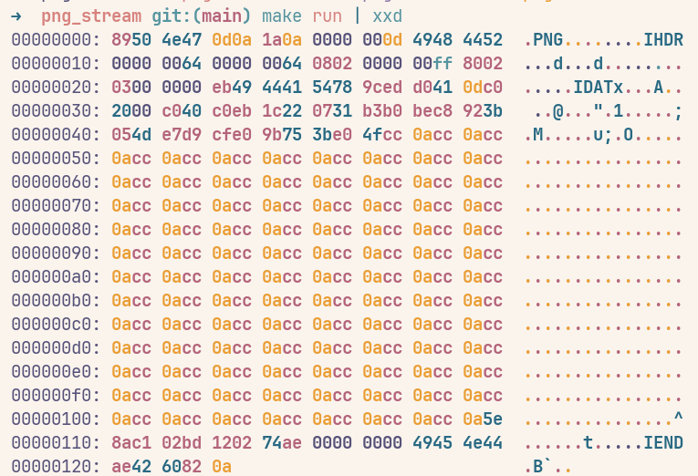

# PngStream

A generalized streamy way to render out png's

You would need cpp 20 for this to work, since it uses function style casting
and some other modern cpp features

The output is a string that can be converted to a binary `uint8_t` vector and 
written to a file stream that would be seen
Or you can also use the xxd utility to check it out
```bash
make run | xxd
```

The output would be something like this:



Licensed under AGPL

Libs used: zlib
